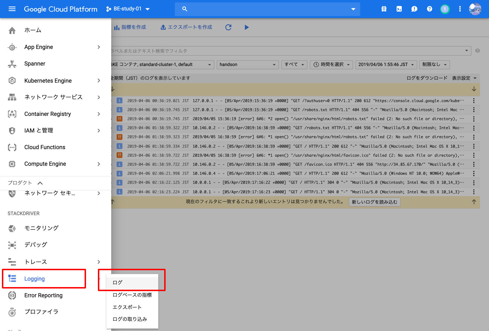

Kubernetesの空気感を知るために、クラスターを立ち上げてシンプルなWebアプリケーションを起動してみましょう

* GKEクラスターを構築する
* Dockerを起動する
* ロードバランサでリクエストを受ける

## GCPへログイン

[https://console.cloud.google.com/home/dashboard](https://console.cloud.google.com/home/dashboard)

今回はGoogle Cloud Platform のマネージドKubernetesである **"Google Kubernetes Engine"** を使います。  
まずはブラウザでGCPのコンソールを表示しましょう。

## Kubernetesクラスターの作成
Kubernetesのクラスターを作成します。  


GCPコンソールのメニューを展開し、 **"Kubernetes Engine > クラスタ"** を選択します。


GKEを初めて選択する場合はAPIの有効化が必要になります。1分ほど待ちましょう。


**"クラスタの作成"** を選択して作成を開始します。


ゾーンだけ **"asia-northeast-1a"** (東京)に変更します。ゾーンはデータセンターの場所のことです。  
変更後、 **"作成"** を押下します。


GKEの作成は5分ほど必要です。  
ステータスがグリーンになったらKubernetesクラスターの作成完了です！

## CLIからKubernetesを使用する準備
以降、コマンドはGCPコンソールで動かすことができるシェル(Cloud Shell)で操作します。  


Cloud ShellはGCPのヘッダーのボタンを押すことで起動します。  
シェルの立ち上げに3分ほどかかるので少し待ちましょう。


シェルの立ち上げ後、KubernetesをCLI上で操作するための認証情報を取得します。  

```console
$ gcloud container clusters get-credentials standard-cluster-1 --zone asia-northeast1-a
kubeconfig entry generated for standard-cluster-1.
```

認証できているか確認のため、KubernetesをCLIで操作するための `kubectl` コマンドでKubernetes上の現在のObjectsを表示してみます。
```console
$ kubectl get all
NAME                 TYPE        CLUSTER-IP   EXTERNAL-IP   PORT(S)   AGE
service/kubernetes   ClusterIP   10.3.240.1   <none>        443/TCP   10m
```

!!! note "Objects とは"
    Kubernetesを構成するリソースのことを **"Objects"** と呼びます。  
    Dockerコンテナ・ロードバランサ・認証/認可・オートスケール・サービスディスカバリ・セルフヒーリングなど、様々な責務を持ったObjectsが存在します。  
    Objectsは独自に作成することも可能です。  
    非常に機能が多く一気に学ぶと混乱しやすいため、この章ではDeploymentとServiceだけを意識すると良いでしょう。  

## Dockerを起動する
NginxのDockerイメージをGKE上で起動してみましょう。  

`kubectl run <命名> --image=<Dockerイメージ>` でDockerを起動することができます。  
今回は **"handson"** という名前で **"nginx Dockerイメージ"** を起動してみましょう。  
また、立ち上げたnginxコンテナへトラフィックを流したいため、 `--port 80` で80ポートでトラフィックを受けられるよう設定します。

```console
$ kubectl run handson --image nginx --port 80
deployment.apps/handson created
```

現在のKubernetesのObjectsを確認してみます。  
以下のように2行目の"STATUS"が"Running"の表示になっていることを確認してください。 
新しく現れたObjectsが複数ありますが、 **「とりあえずnginxのDockerイメージが立ち上がった」** ことを確認できれば問題ありません。
```console
$ kubectl get all
NAME                           READY     STATUS    RESTARTS   AGE
pod/handson-57bb9b4684-mgdkl   1/1       Running   0          10s
NAME                 TYPE        CLUSTER-IP   EXTERNAL-IP   PORT(S)   AGE
service/kubernetes   ClusterIP   10.3.240.1   <none>        443/TCP   1h
NAME                      DESIRED   CURRENT   UP-TO-DATE   AVAILABLE   AGE
deployment.apps/handson   1         1         1            1           10s
NAME                                 DESIRED   CURRENT   READY     AGE
replicaset.apps/handson-57bb9b4684   1         1         1         10s
```

## ロードバランサの起動
Kubernetes上でロードバランサを作成して、先程作成した"handson"というnginxコンテナへトラフィックを流してみましょう。

`kubectl expose` でロードバランサを作成することができます。  
以下の通りロードバランサ経由でコンテナにトラフィックを流してみましょう。

```console
$ kubectl expose deploy handson --port=80 --target-port=80 --type=LoadBalancer
service/handson exposed
```

少し待つと、 `service/handson` の "EXTERNAL-IP" が付与されます。  
```console
$ kubectl get all
NAME                           READY     STATUS    RESTARTS   AGE
pod/handson-86f796b8b7-m68sr   1/1       Running   0          4m
NAME                 TYPE           CLUSTER-IP   EXTERNAL-IP    PORT(S)        AGE
service/handson      LoadBalancer   10.3.243.4   34.85.67.170   80:32621/TCP   4m
service/kubernetes   ClusterIP      10.3.240.1   <none>         443/TCP        2h
NAME                      DESIRED   CURRENT   UP-TO-DATE   AVAILABLE   AGE
deployment.apps/handson   1         1         1            1           4m
NAME                                 DESIRED   CURRENT   READY     AGE
replicaset.apps/handson-86f796b8b7   1         1         1         4m
```

表示されたIPへアクセスして、nginxに接続できていることを確認しましょう

## GUIで動作確認
GCPコンソールからKubernetes Objects の詳細を閲覧することができます。  
今回動かした **"handson"** という名前をつけたObjectsがどのように動いているのかGCPコンソール上で見てみましょう。

コンテナの状態を確認  
( [StackDriver](https://app.google.stackdriver.com) を有効化していないとCPU/Memoryなどのメトリクスは取得できません)


ロードバランサの確認  


ログの閲覧



## まとめ
GKEのクラスターを作成し、 `kubectl` コマンドからnginxのDockerコンテナを動かしてロードバランサを介してWeb上に公開することができました。  
コンテナを動かしてHTTPリクエストを受けるだけの単純なアプリケーションならここまでの操作で可能でしょう。

