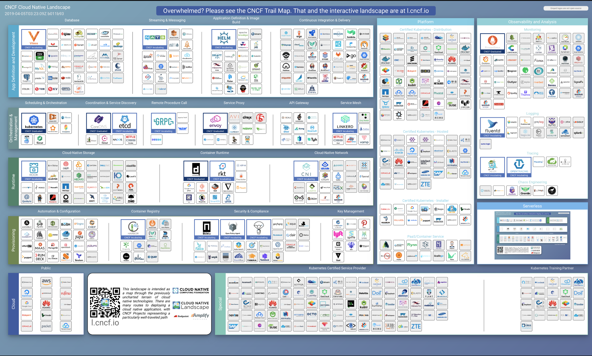

このハンズオンは「初めてKubernetesを触ってみよう」と考えている入門者をターゲットにしています。  
本番環境でゴリゴリにKubernetesを運用するためのドキュメントは世に複数あるので、このドキュメントは「なるべく簡単にKubernetesを知ってもらう」ことを目標としています。  

[kubernetes/kubernetes](https://github.com/kubernetes/kubernetes)

コンテナオーケストレーションツールのデファクトスタンダードと呼ばれているのがKubernetesです。  
他のコンテナオーケストレーションツールと比較して **自由度が高い** 反面、 **学習コストが高い** ことが特徴です。

KubernetesはGoogle内で使われているコンテナオーケストレーションツール(Borg)が前進となっており、Googleのエンジニアが開発しました。   
2015年にv1.0がリリースされ、現在(19/04/07)は1.15までリリースされています。  

## Kubernetes クラスター
  
_ [https://github.com/kubernetes/kubernetes/blob/release-1.1/docs/design/architecture.md](https://github.com/kubernetes/kubernetes/blob/release-1.1/docs/design/architecture.md)_

Kubernetesは大きく2つのコンポーネントでクラスターを構成しています。

1. Control Plane
    - ユーザーからのリクエストを受け、 **クラスター内の状態を管理** する
2. Worker Nodes
    - 複数台のマシンが **Dockerのリソースプール** として協調して動作する

## マネージドサービス

Kubernetesクラスターを運用するには様々なことを考えなければいけません。  
Dockerをデプロイするだけではなく、Dockerを乗せるためのWorker Node郡の管理、そのWorker Node郡を管理するためのControl Plane の管理、、、それぞれ高度な知識が必要になってきます。  

大手クラウドベンダーではKubernetesクラスターがマネージドサービスが存在します(GCP/AWS/Azure/etc...)。  
クラスターの構築から基本的なから管理運用までをクラウドベンダーが責任を負い、サービス利用者はKubernetesの美味しいところだけを扱えるような設計になっています。

今回のハンズオンでは筆者がKubernetesと特に相性が良いと考えている、Google Cloud Platform で提供されているマネージドKubernetes、GKE(Google Kubernetes Engine)を使います。

## エコシステム
  
_[cncf/landscape](https://github.com/cncf/landscape)_

「Kubernetesはクラウド時代のOS」と言っても過言ではないと思っています。  
Kubernetesを中心にクラウドネイティブなプロダクトをホストする組織が存在し、既に300以上のプロダクトがホストされています。  
ホストされているものはコンテナ・監視・DB・etcなど、アプリケーションの構築に必要なコンポーネントが揃っています。
